# sensor_log_analyzer


A command-line tool for parsing, cleaning, and calibrating IMU (accelerometer) CSV logs. Reads `t_ms, ax, ay, az` data, computes statistics, detects time axis anomalies, writes JSON reports, and performs 3-axis accelerometer calibration via least-squares fitting.

---

## Table of Contents

- [Requirements](#requirements)
- [Building](#building)
- [Running Tests](#running-tests)
- [Commands](#commands)
  - [analyze](#analyze)
  - [clean](#clean)
  - [calib](#calib)
- [Input Format](#input-format)
- [Output Files](#output-files)
  - [Analysis JSON Report](#analysis-json-report)
  - [Calibration JSON Report](#calibration-json-report)
- [Python Visualization Scripts](#python-visualization-scripts)
- [Screenshots](#screenshots)
- [Exit Codes](#exit-codes)
- [Project Structure](#project-structure)

---

## Requirements

| Tool / Library | Version |
|---|---|
| C++ compiler | GCC 13+ (MinGW64 or UCRT64) with C++20 |
| CMake | 3.20+ |
| vcpkg | latest |
| fmt | via vcpkg |
| nlohmann-json | via vcpkg |
| fast-float | via vcpkg |
| Catch2 | 3.x via vcpkg (for tests) |
| Python 3 | for visualization scripts only |
| matplotlib, numpy | pip install (scripts only) |

---

## Building

### 1. Install dependencies via vcpkg

```bash
vcpkg install
```

### 2. Configure and build

```bash
cmake -B build -S . -DCMAKE_TOOLCHAIN_FILE=<path-to-vcpkg>/scripts/buildsystems/vcpkg.cmake
cmake --build build
```

To build **with tests** enabled (default):

```bash
cmake -B build -S . -DCMAKE_TOOLCHAIN_FILE=... -DBUILD_TESTING=ON
cmake --build build
```

The binary is placed in `build/` as `sla` (or `sla.exe` on Windows).

---

## Running Tests

```bash
cd build
ctest --output-on-failure
```

Or run the test binary directly:

```bash
./unit_tests
```

The test suite covers: `util`, `csv_split`, `number_parse`, `WelfordStats`, `time_axis`.

---

## Commands

All commands follow this pattern:

```
sla <command> --input <file> [options]
```

Run `sla --help` for full usage info.

---

### analyze

Parse the CSV, compute per-axis statistics (min, max, mean, std), analyze the time axis, and write a JSON report. No data is modified.

```
sla analyze --input <file.csv>
```

**Options:**

| Option | Description |
|---|---|
| `--input <file>` | Input CSV file (`t_ms,ax,ay,az`). Required. |

**Output:**
- Prints a summary to stdout
- Writes a JSON report to `<input_name>.json` (same directory as input)

**Example:**

```bash
sla analyze --input data/imu_dirty.csv
```

**Console output:**
```
Report written to: data/imu_dirty.json

=== Analysis Summary ===
Input file: imu_dirty.csv
Total lines: 1002
Parsed lines: 998
Bad lines: 4
Warnings: 4

Sampling frequency: 100.00 Hz
Time interval stats (ms):
  mean: 10.000
  std:  0.000
```

---

### clean

Parse the CSV, skip all malformed lines, and write a clean copy. Also produces the same JSON analysis report as `analyze`.

```
sla clean --input <file.csv>
```

**Options:**

| Option | Description |
|---|---|
| `--input <file>` | Input CSV file. Required. |

**Output:**
- `<stem>_clean.csv` — valid rows only, same directory as input
- `<stem>.json` — analysis report

**Example:**

```bash
sla clean --input data/imu_dirty.csv
# produces: data/imu_dirty_clean.csv
#           data/imu_dirty.json
```

> The clean file is written atomically via a `.tmp` intermediate file — if writing fails, the original is never corrupted.

---

### calib

Perform 3-axis accelerometer calibration using 8 static positions. Computes a 3×3 scale/cross-axis matrix **M** and bias vector **b** via least-squares, then applies the correction to the full dataset.

```
sla calib --input <file.csv> [--position <POSITION.txt>]
```

**Options:**

| Option | Default | Description |
|---|---|---|
| `--input <file>` | — | Input CSV (raw IMU data). Required. |
| `--position <file>` | `<input_dir>/POSITION.txt` | Path to the position definition file. |

**Output:**
- `<stem>_calib.csv` — corrected accelerometer data
- `<stem>_calib.json` — calibration report with coefficients and per-position residuals

**Example:**

```bash
sla calib --input data/data.csv
# produces: data/data_calib.csv
#           data/data_calib.json
```

**Console output (excerpt):**
```
Raw(steady)  max(|mag-g|) = 0.401000
Corr(steady) max(|mag-g|) = 0.008171
Corr mag stats(steady): mean=9.810562, std=0.002235, min=9.803491, max=9.818124
M=
[1.009982  0.001470 -0.001596]
[−0.000259 0.980082 -0.000063]
[0.000733  0.000123  1.029982]
b=(−0.302498, 0.201089, 0.102889)
```

---

## Input Format

The tool expects a CSV file with exactly this header and four columns:

```
t_ms,ax,ay,az
11,0.00717,0.02528,1.00018
22,0.00623,0.02266,1.00690
...
```

| Column | Type | Description |
|---|---|---|
| `t_ms` | integer (ms) | Timestamp in milliseconds |
| `ax` | double | Acceleration X (g or m/s²) |
| `ay` | double | Acceleration Y |
| `az` | double | Acceleration Z |

**Robustness:** Lines with wrong column count, non-numeric values, truncated floats (e.g. `9.896e-`), or garbage characters are treated as bad lines, reported in warnings, and skipped. They do not cause the tool to exit.

---

## Output Files

### Analysis JSON Report

Written by both `analyze` and `clean` to `<input_name>.json`:

```json
{
    "input": "imu_dirty.csv",
    "counts": {
        "total_lines": 1002,
        "empty_lines": 0,
        "comment_lines": 0,
        "header_lines": 1,
        "parsed_lines": 998,
        "bad_lines": 4
    },
    "warnings": [
        {
            "line": 470,
            "message": "invalid value",
            "column": 4,
            "value": "\"№;\"\"4\"\"\""
        }
    ],
    "warnings_dropped": 0,
    "time_axis": {
        "dt_available": true,
        "dt_ms": {
            "count": 997,
            "min": 9.0,
            "max": 11.0,
            "mean": 10.001,
            "std": 0.031
        },
        "sampling_hz_est": 99.99,
        "anomalies": {
            "non_increasing": 0,
            "duplicates": 0,
            "gaps": 1
        }
    },
    "statistics": {
        "ax": { "count": 998, "min": -0.031, "max": 0.036, "mean": 0.005, "std": 0.012 },
        "ay": { "count": 998, "min": -0.029, "max": 0.033, "mean": 0.011, "std": 0.014 },
        "az": { "count": 998, "min": 0.968,  "max": 1.029, "mean": 1.001, "std": 0.007 }
    }
}
```

### Calibration JSON Report

Written by `calib` to `<stem>_calib.json`. Contains measurement model `M`, bias `b`, correction matrix `C = inv(M)`, and per-position raw vs corrected residuals:

```json
{
    "meta": { "gravity": 9.81054, "L": 10000, "npos": 8, ... },
    "coeffs": {
        "M": [[1.009, 0.001, -0.002], ...],
        "b": { "x": -0.302, "y": 0.201, "z": 0.103 },
        "C": [[0.990, -0.001, 0.002], ...]
    },
    "points": [
        {
            "position": 1,
            "ref":       { "x": 9.81054, "y": 0.0, "z": 0.0 },
            "raw_mean":  { "x": 9.604,   "y": 0.204, "z": 0.103 },
            "corr_mean": { "x": 9.809,   "y": 0.006, "z": -0.007 },
            "res_raw":   { "x": -0.206,  "y": 0.204, "z": 0.103 },
            "res_corr":  { "x": -0.002,  "y": 0.006, "z": -0.007 }
        }
    ]
}
```

---

## Python Visualization Scripts

All scripts are in `scripts/` and require `matplotlib` and `numpy`.

```bash
pip install matplotlib numpy
```

| Script | Description | Example |
|---|---|---|
| `curve_raw_all_axes.py` | Calibration curves (raw) for X/Y/Z | `python scripts/curve_raw_all_axes.py --json data/data_calib.json` |
| `curve_corr_all_axes.py` | Calibration curves (calibrated) for X/Y/Z | `python scripts/curve_corr_all_axes.py --json data/data_calib.json` |
| `residuals_all_axes.py` | Residuals vs reference per axis | `python scripts/residuals_all_axes.py --json data/data_calib.json` |
| `hist_residuals_all_axes.py` | Histograms of raw vs corrected residuals | `python scripts/hist_residuals_all_axes.py --json data/data_calib.json` |
| `metrics_and_bars_all_axes.py` | RMSE / MaxAbs bar charts + metrics CSV | `python scripts/metrics_and_bars_all_axes.py --json data/data_calib.json` |
| `metrics_hist_timeseries_from_json_segments.py` | Residuals over all steady samples from full timeseries | `python scripts/metrics_hist_timeseries_from_json_segments.py --json data/data_calib.json --raw_csv data/data.csv --corr_csv data/data_calib.csv` |
| `plot_time_raw_vs_corr_3axes_interactive.py` | Time-series: raw vs calibrated ax/ay/az | `python scripts/plot_time_raw_vs_corr_3axes_interactive.py --raw data/data.csv --corr data/data_calib.csv --show` |

All scripts save output images to `plots/` by default (`--outdir` to override).

---

## Screenshots

### Calibration Curves

Scatter plots of measured vs reference gravity per axis — shows the raw sensor error and how well the correction fits.

| X axis (raw) | X axis (calibrated) |
|:---:|:---:|
| 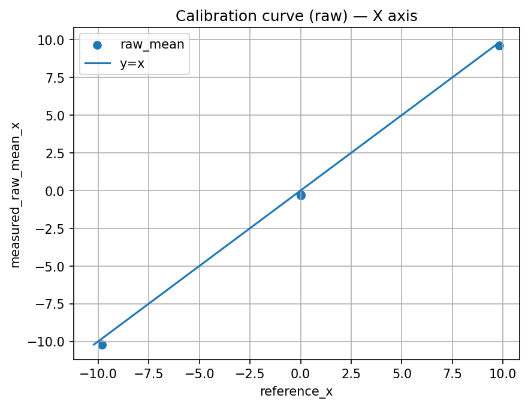 |  |

| Y axis (raw) | Y axis (calibrated) |
|:---:|:---:|
| 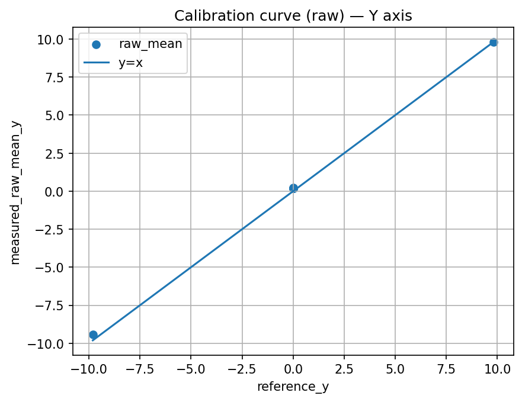 | 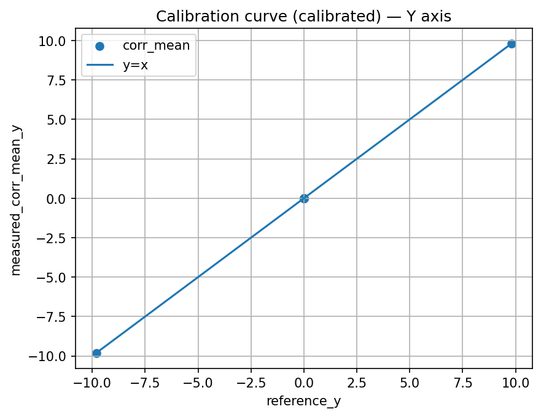 |

| Z axis (raw) | Z axis (calibrated) |
|:---:|:---:|
|  |  |

---

### Residuals vs Reference (8 calibration positions)

| X axis | Y axis | Z axis |
|:---:|:---:|:---:|
| 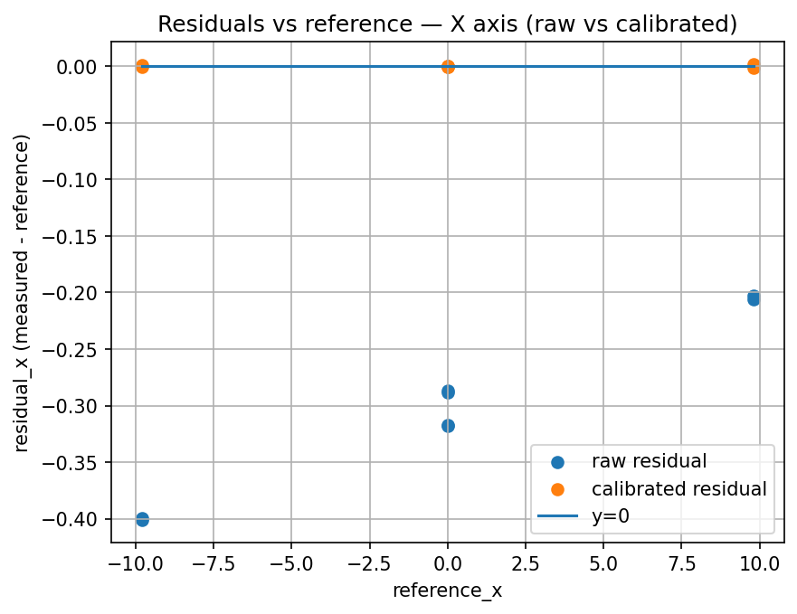 | 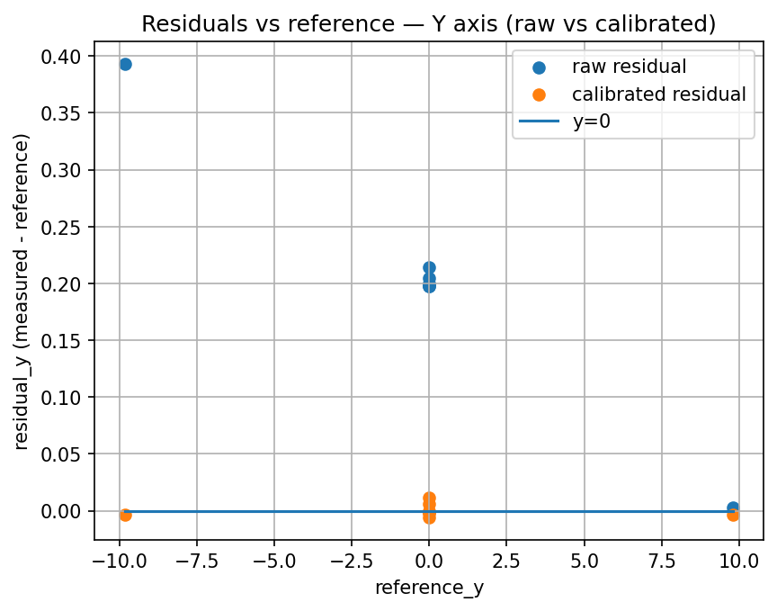 | 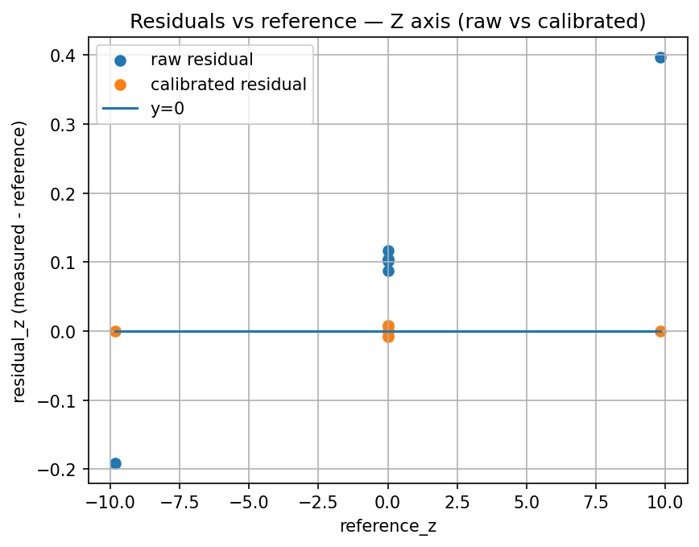 |

Raw residuals show a clear bias offset. After calibration, all three axes center near zero.

---

### Residual Histograms (steady-window samples from full timeseries)

| X axis | Y axis | Z axis |
|:---:|:---:|:---:|
| 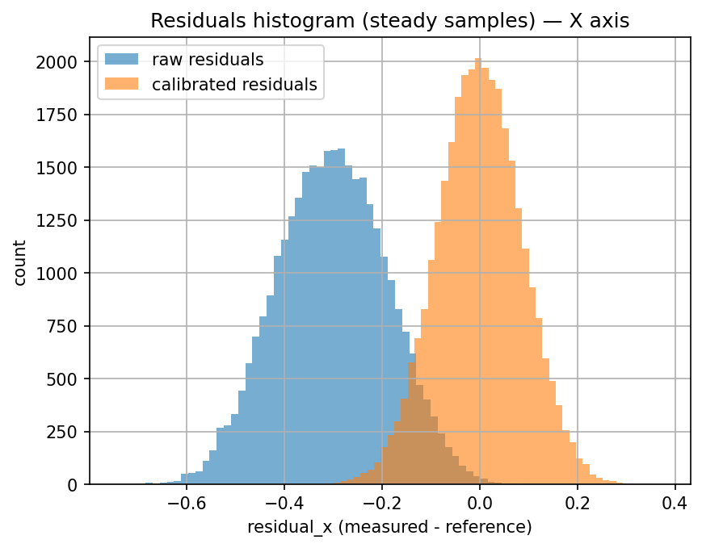 | 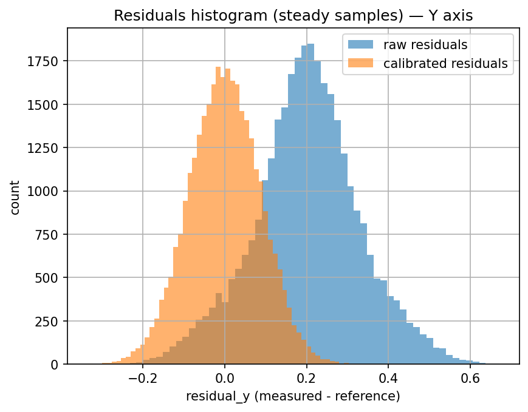 | 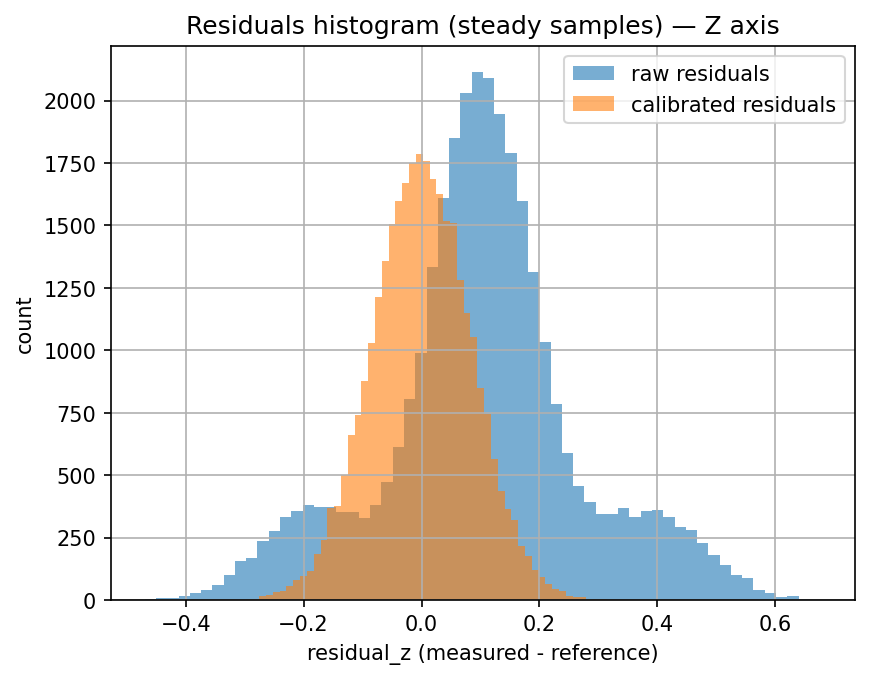 |

---

### RMSE and MaxAbs — Calibration Points vs Full Timeseries

| RMSE (8 positions) | MaxAbs (8 positions) |
|:---:|:---:|
| 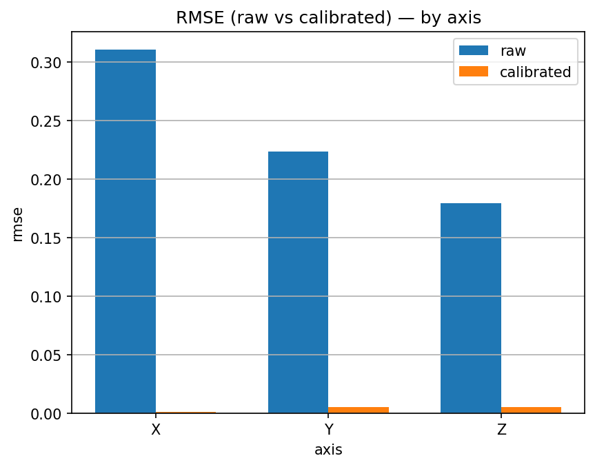 | 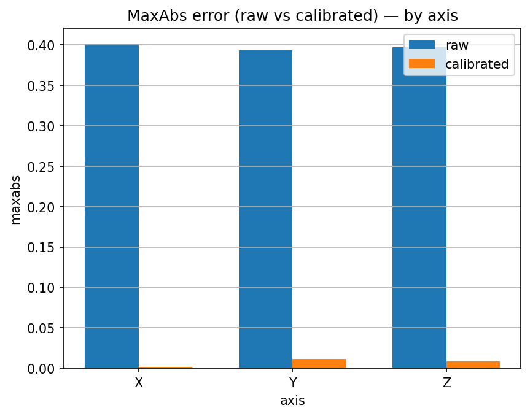 |

| RMSE (full timeseries) | MaxAbs (full timeseries) |
|:---:|:---:|
| 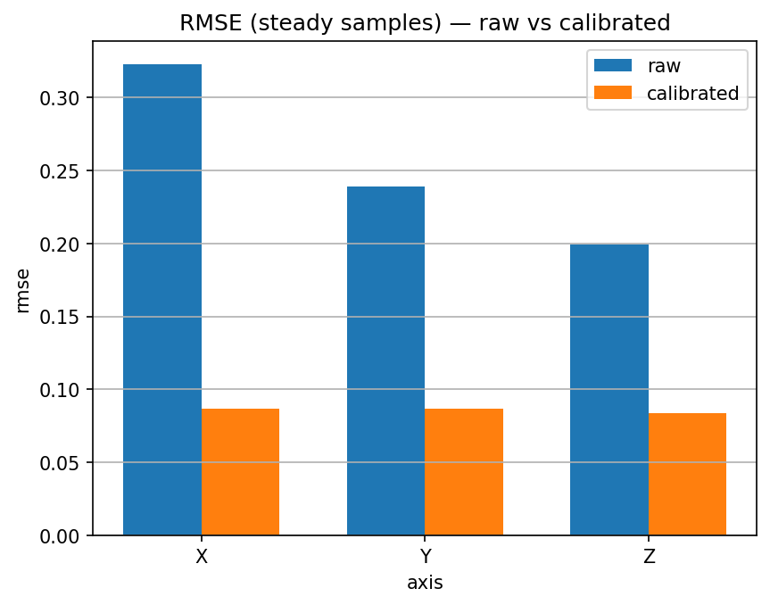 | 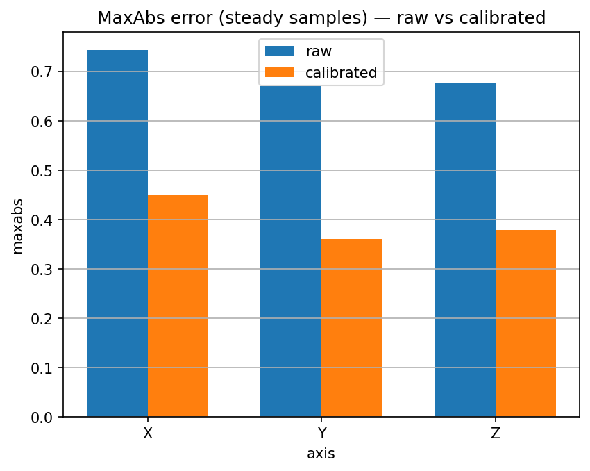 |

---

### Time-Series: Raw vs Calibrated

| ax | ay | az |
|:---:|:---:|:---:|
| 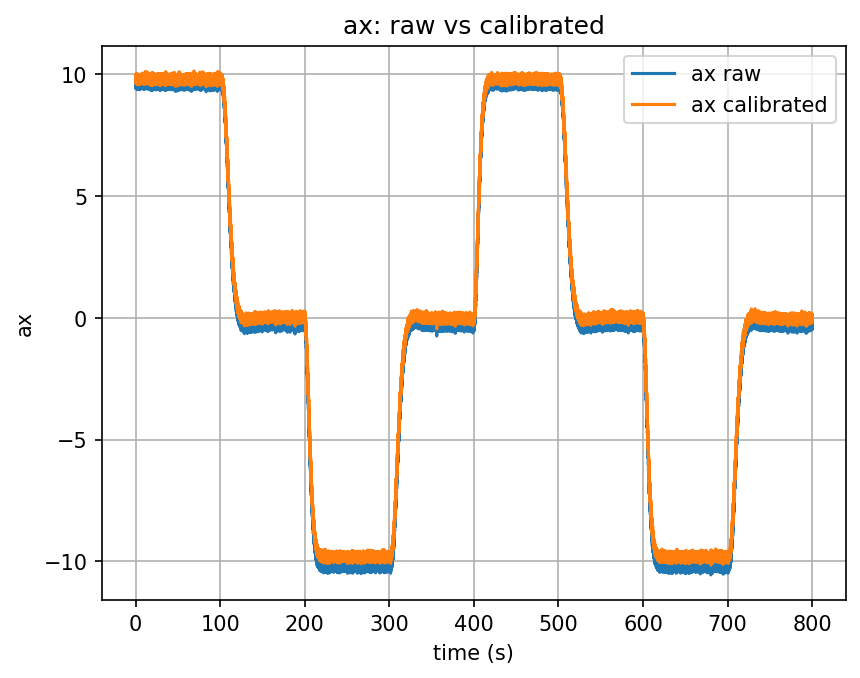 | 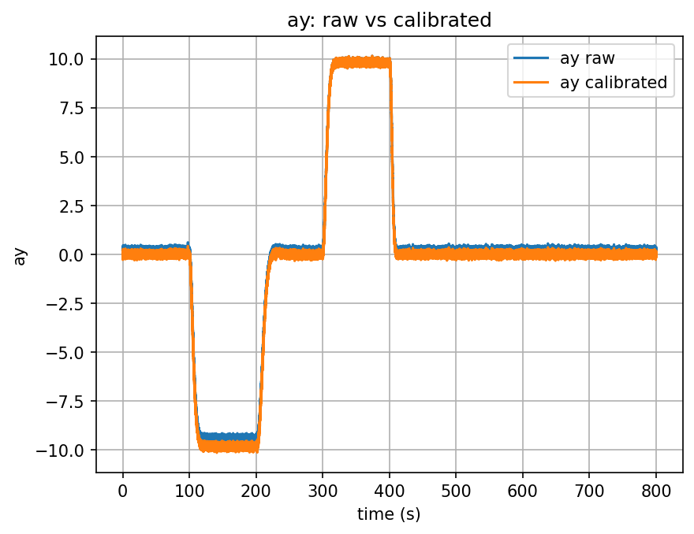 | 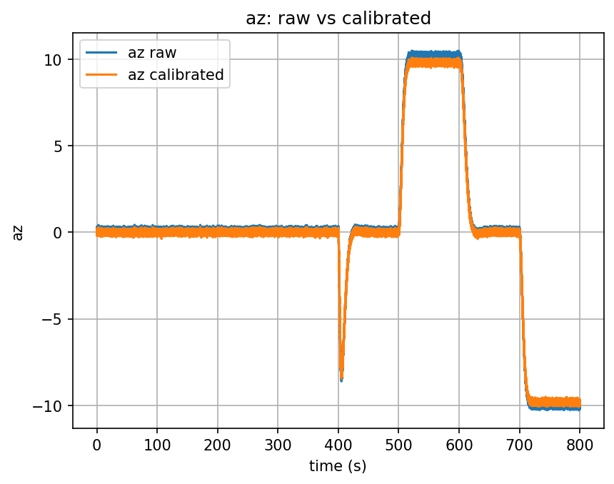 |

Full ~80 000-sample recording. The DC bias shift on each axis is clearly visible before calibration and removed after.

---

## Exit Codes

| Code | Meaning |
|---|---|
| `0` | Success |
| `1` | Error (bad arguments, file not found, parse failure, calibration error) |

Errors are always printed to `stderr` with a descriptive message.

---

## Project Structure

```
sensor_log_analyzer/
├── include/
│   └── sla/
│       ├── cli.hpp                  # CLI: Options, Command enum, ParseResult
│       ├── csv.hpp                  # CsvStreamResult, read_imu_csv_streaming()
│       ├── csv_split.hpp            # split_csv() — splits one line into 4 tokens
│       ├── number_parse.hpp         # parse_simple_double(), parse_row_to_array_sv()
│       ├── util.hpp                 # trim()
│       ├── welford_stats.hpp        # WelfordStats (online mean/variance), Stats struct
│       ├── time_axis.hpp            # TimeAxisReport, make_time_axis_report_streaming()
│       ├── report.hpp               # Report, Counts, Warning, ImuStatistics structs
│       ├── report_json.hpp          # report_to_json(), write_report_json_file()
│       ├── writer.hpp               # CsvWriter, make_clean_path(), make_calib_path()
│       └── calibration.hpp          # CalibrationOptions, CalibrationResult, run_calibration()
├── src/
│   ├── main.cpp                     # Entry point, CLI dispatch, analysis loop
│   ├── cli.cpp                      # parse_args(), print_usage()
│   ├── csv.cpp                      # read_imu_csv_streaming() implementation
│   ├── csv_split.cpp
│   ├── number_parse.cpp             # is_simple_decimal(), fast_float wrapper
│   ├── util.cpp
│   ├── time_axis.cpp                # Two-pass streaming time axis analysis
│   ├── report_json.cpp
│   ├── writer.cpp
│   └── calibration.cpp              # Least-squares calibration (Gauss elimination, 12×12)
├── tests/
│   ├── test_util.cpp
│   ├── test_csv_split.cpp
│   ├── test_number_parse.cpp
│   ├── test_welford.cpp
│   └── test_time_axis.cpp
├── scripts/                         # Python visualization scripts
├── data/
│   ├── POSITION.txt                 # 8 calibration positions (INNER / OUTER angles)
│   ├── imu_clean.csv                # Example clean IMU data
│   ├── imu_dirty.csv                # Example data with intentional bad lines
│   ├── data.json                    # Example analysis report output
│   └── data_calib.json              # Example calibration report output
├── plots/                           # Generated charts (git-ignored)
├── ports/catch2/                    # Custom vcpkg port for Catch2 3.x
├── vcpkg.json
├── vcpkg-configuration.json
└── CMakeLists.txt
```

### Calibration algorithm in brief

The model is `a_meas = M * a_true + b`, where `M` is a 3×3 scale/cross-axis matrix and `b` is a bias vector. Given 8 known gravity reference vectors and the measured steady-window means, the system `A * x = Y` (24×12) is solved via normal equations `(A^T A) x = A^T Y` using Gauss elimination with partial pivoting. The correction matrix `C = inv(M)` is then applied to every sample as `a_corr = C * (a_meas - b)`.
